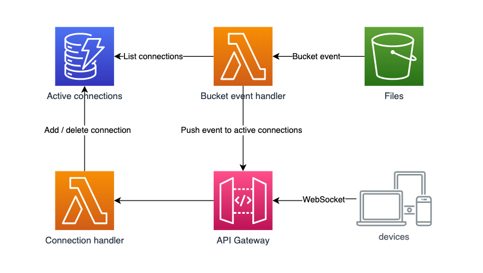

# Broadcast S3 bucket events to API Gateway WebSocket clients

This is a simple example of using CDK to deliver S3 bucket events to WebSocket clients connected via API Gateway:



Infrastructure is defined in [/lib](./lib) and the API logic can be found in [/src/](./src/).

## Running the example

Execute `cdk deploy` to deploy the stack. Once the stack is deployed, CDK will output the WebSocket address for API Gateway, as well as the S3 bucket name.

To establish a WebSocket connection to the API Gateway, you can use something like [Insomnia](https://insomnia.rest/products/insomnia) or whatever tool you prefer. Once you've established the WebSocket connection, copy a file to the S3 bucket using aws-cli:

```
aws s3 cp ./your_file_here.txt s3://your-bucket-here
```

You should see a notification delivered over the WebSocket connection with details of the bucket and the created object:

```json
[
  {
    "bucket": "s3websocketeventsstack-targetbucket6bbf3429-s9n5fcvf3242",
    "object": "your_file_here.txt"
  }
]
```
