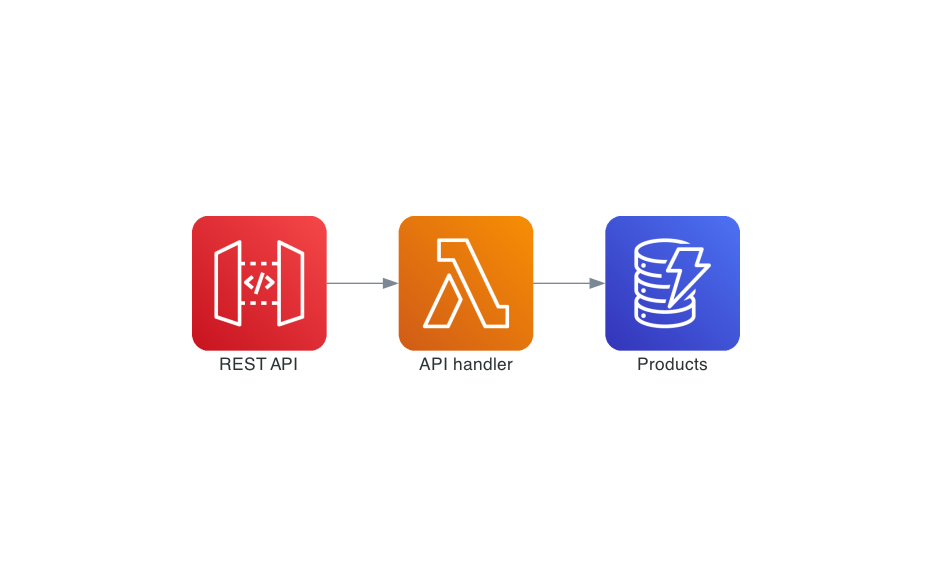

# Serverless REST API using API Gateway + Lambda + DynamoDB

This is a simple example of using CDK to create a serverless REST API:

The dummy REST API supports a few different operations:

- `GET /v1/products/` returns a list of products
- `POST /v1/products/` adds a new product
- `GET /v1/products/{uuid}` returns a single product
- `DELETE /v1/products/{uuid}` deletes a product

Infrastructure is defined in [/lib](./lib) and the API logic can be found in [/src/api.ts](./src/api.ts).

## Running the example

Execute `cdk deploy` to deploy the stack. Once the stack is deployed, CDK will output the URL for the API.
